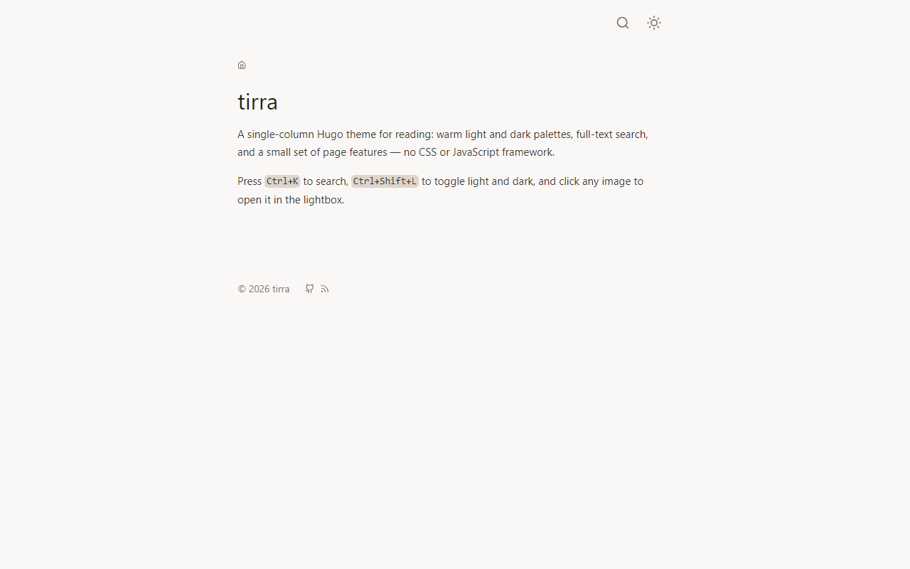
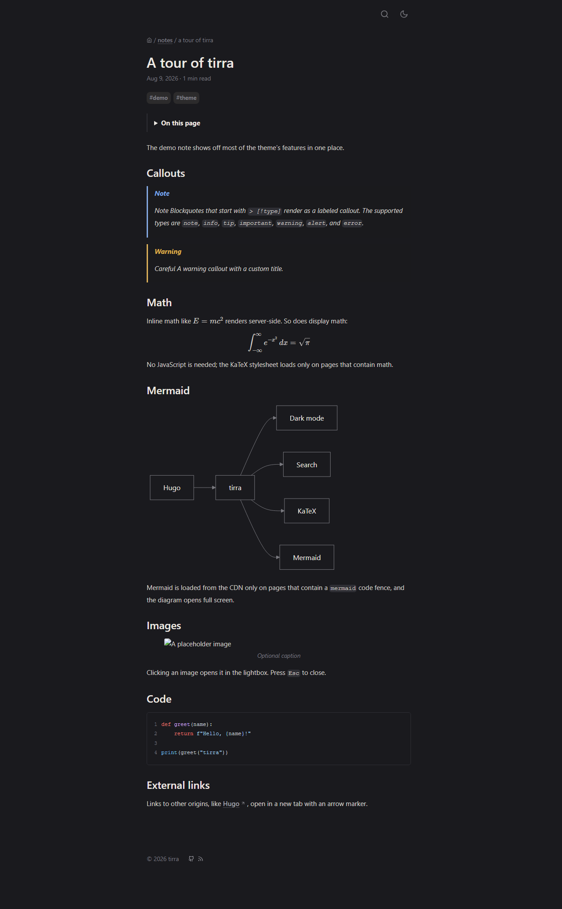
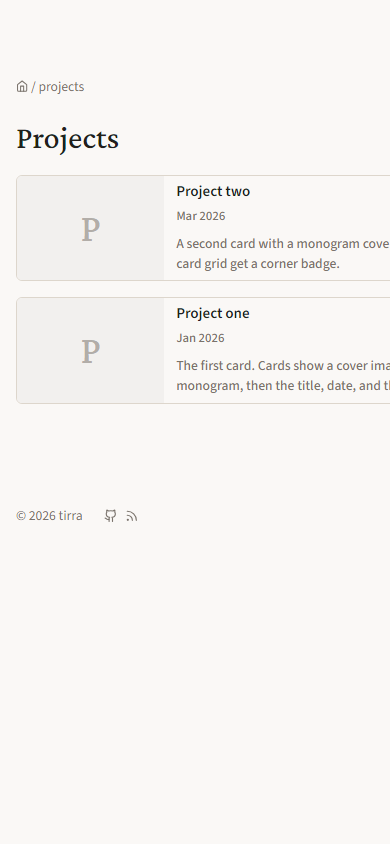

# tirra

Single-column Hugo theme for reading. Narrow text column, warm light and dark palettes, and a small set of page features. No CSS or JavaScript framework.

## Screenshots

<p>
  
  
  
</p>

## Features

- Dark mode; default follows `prefers-color-scheme`, toggle saved to `localStorage`
- Full-text search (`Ctrl+K`/`Cmd+K`) over the JSON page index, matched with Fuse.js
- Table of contents, reading time (plus the last-modified date when a page has one), reading progress bar, and back-to-top
- Offline reading: a network-first service worker (fresh content when online, the last view when offline) and an installable web app manifest
- Copy buttons, image lightbox, callouts, Mermaid, server-side KaTeX, external-link markers, print stylesheet; see Content below

## Quick start

Fork the demo instead of starting from the empty template:

```sh
git clone https://github.com/himloul/tirra && cp -r tirra/exampleSite my-site
cd my-site && ln -s ../tirra themes/tirra
hugo server
```

Then edit `hugo.toml` and delete the demo posts under `content/` until only your own remain.

## Install

Copy `themes/tirra` into your site's `themes/` directory (or add it as a submodule), then set in `hugo.toml`:

```toml
theme = "tirra"

[markup]
  _merge = "deep"
```

`_merge = "deep"` lets the theme's markup defaults (themed code blocks instead of Chroma's default styling) apply; your own `[markup]` settings still win. To set highlight explicitly instead, use `noClasses = false`.

## Demo site

The `exampleSite/` directory is a working demo of every feature. From the theme root, link it and run:

```sh
ln -s ../.. exampleSite/themes/tirra
hugo server -s exampleSite
```

The symlink name must match the theme name (`tirra`); it is not committed; the CI workflow creates it.

## Static files

Put these in `static/` (a missing file only causes a 404 on that link; the build is unaffected):

- `favicon.ico`, `favicon-16x16.png`, `favicon-32x32.png`, `apple-touch-icon.png`
- `og-image.png` (1200x630), used by Open Graph and Twitter cards
- `katex/katex.min.css` and `katex/fonts/`, the KaTeX stylesheet and its web fonts, needed only if you use math. The theme ships no KaTeX assets; download them from a KaTeX release and copy them under `static/katex/` (keep the `fonts/` subdirectory).

## Configuration

Start from the [exampleSite](#demo-site): copy it, keep `[markup]` and `theme = "tirra"`, edit `baseURL` and `title`. Everything else it shows is optional; what you skip falls back to the defaults in `main.css`:

- **Palette / width**: `[params.theme.color]` and `colorDark` restyle light and dark; `contentWidth` sets the column. Unset, the `--*` variables at the top of `main.css` rule.
- **Fonts**: see [Fonts](#fonts). Optional; the system fallbacks in `main.css` otherwise.
- **Search / PWA**: the home `outputs` (`JSON`, `WEBMANIFEST`) turn on the search index and the installable manifest (plus `static/icon-192.png` and `icon-512.png`). Tune the matcher via `[params.theme.search]` (`threshold`, `distance`, `minMatchCharLength`, `limit`).
- **Math / images**: the `[markup]` block covers KaTeX passthrough and image sizing; usage in [Content](#content).
- **`[taxonomies] tag = "tags"`**: assumed by the tag links.
- **`enableRobotsTXT`**: ships a robots.txt layout with the theme.

## Content

- **KaTeX**: `$$...$$` (display), `\[...\]`, `\(...\)`, or `$...$` (inline) renders server-side (no JavaScript) and a page containing math automatically gets the stylesheet. Only set `katex: true` in front matter when the stylesheet is needed on a page the render hook doesn't detect (e.g. math generated by a shortcode). Renderer tolerance is `ignore`, so unusual Unicode in formulas never fails the build.
- **Images**: `` renders as a `<figure>` with auto `width`/`height` from the file (no layout shift), `loading="lazy"` and `decoding="async"`, and the title as a `<figcaption>`. To override a size, put the attribute on the line below: `{width=300}`. A bare image (no caption) renders as a plain ``.
- **Callouts**: a blockquote starting with `> [!type]`, optionally with a title (`> [!warning] Careful`), renders as a labeled note, tip, etc. Supported types: `note`, `info`, `tip`, `important`, `warning`, `alert`, `error`; any other type renders as a neutral callout.
- **Mermaid**: a `mermaid` code fence renders as a diagram with copy and full-screen buttons; Mermaid itself loads only on pages that contain a `mermaid` fence.
- **Card grid**: a section or page with `layout: "card-grid"` in front matter renders its child pages as itch.io-style cards (cover image from the `image` param, or a monogram letter; then title, date, and a clamped description). Drafts get a corner badge and never render in production builds.
- **Tags**: pages with a `tags` front-matter list link to `/tags/<tag>/`.
- **Links**: external links open in a new tab (`target="_blank"` + `rel="noopener"`) with a small arrow marker.

## Fonts

Fonts are optional; with none configured the theme renders with the system fallbacks in `main.css`. Name the families you want in `[params.theme.font.google]` and the theme loads them from Google Fonts, deriving each `--font-*` CSS stack from the name:

```toml
[params.theme.font.google]
  heading = "Crimson Pro"
  body = "Source Sans 3"
  code = "Source Code Pro"
```

`body`, `heading`, and `code` are the core roles; `arabic` is an optional fourth, used by `[lang="ar"]` text. The theme requests weights 400, 500, 600, 700 (the weights its CSS uses); set a role to `""` to drop it.

To pin weights or styles instead, write a full Google Fonts spec: `heading = "Crimson Pro:ital,wght@0,500;1,500"`. To use your own fallback stack, override it in `[params.theme.font]`:

```toml
[params.theme.font]
  code = "ui-monospace, 'SF Mono', Menlo, Consolas, monospace"
```

Any role other than the four is loaded but not styled by the theme; write your own CSS (a custom `--font-*` variable or rule) to use it.

## Keyboard shortcuts

- `Ctrl+K` / `Cmd+K`: open search
- `Ctrl+Shift+L` / `Cmd+Shift+L`: toggle light/dark

## License

MIT. See `LICENSE`.