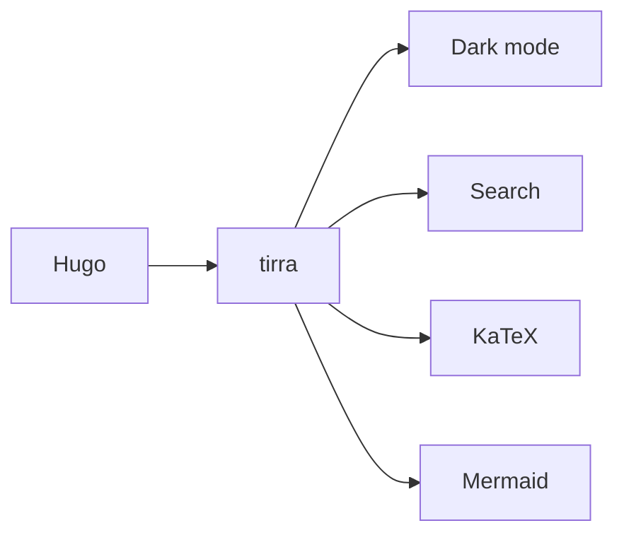

The demo note shows off most of the theme's features in one place.

## Callouts

> [!note] Note
> Blockquotes that start with `> [!type]` render as a labeled callout.
> The supported types are `note`, `info`, `tip`, `important`, `warning`, `alert`, and `error`.

> [!warning] Careful
> A warning callout with a custom title.

## Math

Inline math like $E = mc^2$ renders server-side. So does display math:

$$
\int_{-\infty}^{\infty} e^{-x^2}\,dx = \sqrt{\pi}
$$

No JavaScript is needed; the KaTeX stylesheet loads only on pages that contain math.

## Mermaid



Mermaid is loaded from the CDN only on pages that contain a `mermaid` code fence, and the diagram opens full screen.

## Images


Clicking an image opens it in the lightbox. Press `Esc` to close.

## Code

```python
def greet(name):
    return f"Hello, {name}!"

print(greet("tirra"))
```

## External links

Links to other origins, like [Hugo](https://gohugo.io/), open in a new tab with an arrow marker.
